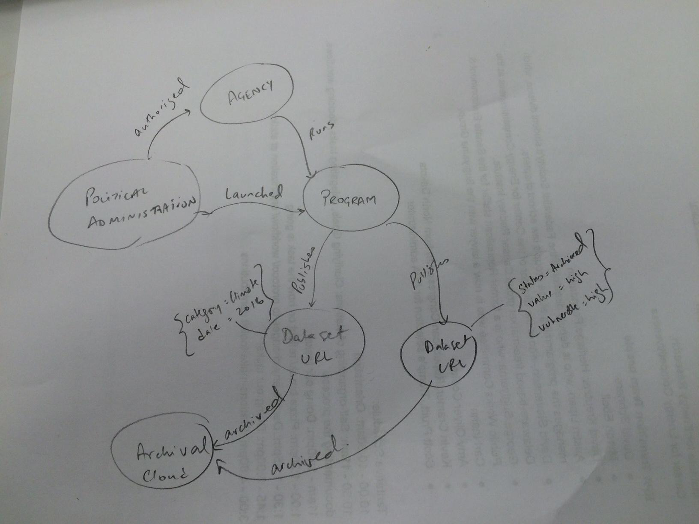

 **Network Graph**

**Summary**

Build a tool that uses the power of graph database technology to represent, understand and track how the various EPA data sets (and Entities) are connected and how this is changing over time.

Specifically, the objective is to visually show entities and relations as a directed graph for following data:

a. Site-map of EPA
b. CSV data found 

The tool is intended to take as input the various lists that other folks in the Guerilla Archiving Event and provide a common visual point for future events to start exploring and analyzing EPA data sets.

Goals

Part 1:
Be able to create a view of the EPA data available. People are creating lists of the data and flagging for protection. This tool is meant to import data into a network graphs, connecting the EPA to other entities and track these interactions over time to observe how these datasets are changing, is the shape of the map changing? Give us the ability to check
whether previous links are still active, and whether shifts in the network indicate which sections of the data are vulnerable.

Also able to track which data sets have already been archived. Help assess which data sets are vulnerable based on changes in the network and archival history.

When we rerun the script, we can track where our network is growing as the amount of data being archived increases, but also seeing where the data is disappearing or being deleted.

Part 2: Site Map

Collects the links from the EPA website and puts it into a hierarchical structure (site map). Will have functionality for checking for duplicates, invalid links, feeds into the graph above. Produced a data set for the Network Graph.

How to Use:

1. Install and start neo4j Graph DB
2. Get the csv file of URLs to import from other teams
3. Tailor the sample Cypher template file provided and import

**Network Graphical View of WIP**: Creates a view of the EPA data that is out there. The tool imports data into a network graphs, showing the connections between the EPA to other entities and tracking these interactions over time to observe how these datasets are changing. Allows users to see how the dataset has grown and decayed between snapshots, making new or lost interconnections more visible, and revealing what aspects of the network have already been archived, and which data sets have been exposed to vulnerability.

Code:

Documentation:

[Inspired by](https://neo4j.com/blog/analyzing-panama-papers-neo4j/)[The International Consortium of Investigative Journalists
(ICIJ)](https://neo4j.com/blog/analyzing-panama-papers-neo4j/)

**Site Map Creation**: 
Collects the links from the EPA website and puts it into a hierarchical structure (site map). Will have functionality for checking for duplicates, invalid links, feeds into the graph above. Produces a data set for the Network Graph.

